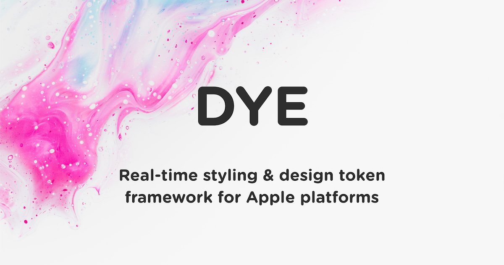

# Dye



## Introduction

Dye is a powerful, real-time styling framework for Apple platforms. Dye handles all the logic of styling UI elements internally, without limiting itself to just the default UI elements or forcing the developer to conform to a specific workflow. New styling options can very easily be added to the framework without any changes being required in the application's code. Dye can be used to style an entire application or just a small part of it, making it easy to add to an existing application and migrating gradually.

Dye uses named styles which are stored in a global cache. A Dye style contains a wide variety of styling options, including font & text properties, backgrounds, strokes, borders, shadows, corners and multiple color options. Using gradients in Dye is ridiculously easy and on iOS or tvOS it also significantly simplifies [Dynamic Type](https://developer.apple.com/documentation/uikit/uifont/scaling_fonts_automatically). Additionally, Dye styles can also inherit from one another, making it possible to set up complex design systems. It's entirely up to the developer (or designer) how simple or complex the styling setup is.

Dye supports real-time updates, meaning that as soon as a global style is added or modified, any object using that style will be updated instantly! No need to restart the app, reload a screen or manually refresh the UI.

## Requirements

- Xcode 11+
- iOS/tvOS 10 or above
- Swift 4.2 or above (when using Swift)

## Installation

### Manually

1. Open Dye.xcodeproj
2. Build the Dye-iOS-Framework, Dye-tvOS-Framework or Dye-macOS-Framework scheme
3. Copy the built Dye.framework file to your project

### Using CocoaPods

Add Dye to your Podfile and run `pod install`.

```ruby
# Podfile
platform :ios, '10.0'

target 'YOUR_TARGET_NAME' do
    # Dynamic frameworks is supported but not required
    use_frameworks!
	
    pod 'Dye'
end
```

## Usage

### Objective-C

Import Dye.h in the implementation files (or in a Prefix header):

```objectivec
#import <Dye/Dye.h>
```

### Swift

Import Dye.h in the Objective-C Bridging Header:

```objectivec
// Bridging header
#import <Dye/Dye.h>
```

Import the Dye module:

```swift
import Dye
```

## DYE Files Explained

These are the most important classes or interfaces you need to know about in order to work with Dye.

- **DYEStyle**: A DYEStyle object represents a named style object containing various styling properties. This is also the class used to access all the styles stored in the global cache.
- **DYEColors**: This is the class used to access all the colors stored in the global cache. It also contains various initializing methods to create colors.
- **DYEColor**: This definition maps to either UIColor (iOS & tvOS) or NSColor (macOS).
- **DYEFont & DYEFontDescriptor**: These definitions map to either UIFont & UIFontDescriptor (iOS & tvOS) or NSFont & NSFontDescriptor (macOS) respectively.
- **DYEStyleable**: This is the interface that styleable objects should conform to in order to be styled with a Dye style. Most UIKit components already conform to this. This is only important if you want to create your own styleable component.

## Documentation

### Creating Dye styles in code

Dye styles can be created in code. Just initialize a DYEStyle object, set the styling properties you want it to have and optionally add it to the global cache. The example below creates a basic text style:

```swift
/// Create a simple text style in code
func createTextStyle() {
    let h1Style = DYEStyle.init(name: "h1")
    h1Style.fontSize = 18.0
    h1Style.fontName = "Courier New"
    h1Style.primaryColor = .black

    // Add to the global cache
    DYEStyle.add(h1Style, withName: h1Style.dyeStyleName)
}
```

```objectivec
/// Create a simple text style in code
- (void)createTextStyle {
    DYEStyle *h1Style = [[DYEStyle alloc] initWithName:@"h1"];
    h1Style.fontSize = 18.0;
    h1Style.fontName = @"Courier New";
    h1Style.primaryColor = [UIColor blackColor];
    
    // Add to the global cache
    [DYEStyle addStyle:h1Style withName:h1Style.dyeStyleName];
}
```

### Import Dye styles from file

Dye styles can also be imported from a JSON file, either a local file in the bundle of the application or a file hosted online. The below example shows both options. Both are loaded asynchronously and can have a completion handler:

```swift
/// Load styles from a JSON file in the bundle
func loadLocalStylesFile() {
    let stylesURL = Bundle.main.url(forResource: "styles", withExtension: "json")
    DYEStyle.importStyles(from: stylesURL!, fileFormat: .JSON, completionHandler: nil)
}

/// Load styles from an online url
func loadOnlineStylesFile() {
    let stylesURL = URL.init(string: "https://mydomain.com/example/styles.json")
    DYEStyle.importStyles(from: stylesURL!, fileFormat: .JSON, completionHandler: nil)
}
```

```objectivec
/// Load styles from a JSON file in the bundle
- (void)loadLocalStylesFile {
    NSURL *stylesURL = [[NSBundle mainBundle] URLForResource:@"styles" withExtension:@"json"];
    [DYEStyle importStylesFromURL:stylesURL fileFormat:DYEFileFormatJSON completionHandler:nil];
}

/// Load styles from an online url
- (void)loadOnlineStylesFile {
    NSURL *stylesURL = [NSURL URLWithString:@"https://mydomain.com/styles.json"];
    [DYEStyle importStylesFromURL:stylesURL fileFormat:DYEFileFormatJSON completionHandler:nil];
}
```

### Apply Dye styles to styleable objects

Any object that conforms to the DYEStyleable interface can have at least 1 Dye style. Most basic UIKit components are already styleable by default, e.g. UIView, UILabel & UIProgressView. Some UIKit components may use multiple styles for different situations, e.g. UIButton which can use a different style for each UIControlState. The example below applies a Dye style to a label and a button:

```swift
/// Apply a style to a label
func applySingleStyle() {
    let label = UILabel.init()
    label.dyeStyleName = "h1"
}

/// Apply styles to a button for multiple control states
func applyMultipleStyles() {
    let button = UIButton.init()
    button.dyeStyleName = "button"
    button.setDyeStyleName("button_highlighted", for: .highlighted)
}
```

```objectivec
/// Apply a style to a label
- (void)applySingleStyle {
    UILabel *label = [[UILabel alloc] init];
    label.dyeStyleName = @"h1";
}

/// Apply styles to a button for multiple control states
- (void)applyMultipleStyles {
    UIButton *button = [[UIButton alloc] init];
    button.dyeStyleName = @"button";
    [button setDyeStyleName:@"button_highlighted" forState:UIControlStateHighlighted];
}
```

## License

Dye is released under an [MIT License](https://opensource.org/licenses/MIT). See LICENSE for details.
